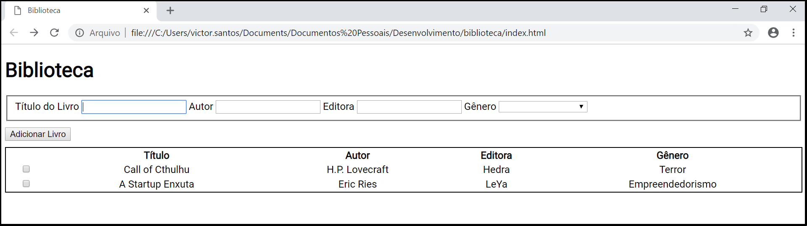

Biblioteca - Ferramenta básica para controle de acervo de livros

A v1.0 contém os seguintes recursos:
- Botão de adicionar livros na estante
- Botão de remover livros selecionados da estante
- Listagem dos livros da estante, mostrando as informações: título, autor, editora e gênero

Em breve novos recursos serão adicionados na ferramenta

Por: Victor F.

//=============================================================================================//

Library - Basic tool for book control

The v1.0 has the following features:
- Button that adds books in the bookcase
- Button that removes selected books from the bookcase
- A list of the books in the bookcase, showing the informations: title, author, publishing company and gender

Soon new features will be add in the tool

By: Victor F.